## dynamic assignments branch in ansible-config-mgt github repo

created a new folder called dynamic assignment to store the env-vars.yml file in.

created an env-vars folder also to store all related environment variable files in.

this is what the file layout looks like:

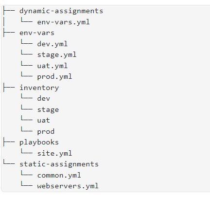

added the following yaml script in the dynamic-assignments/env-vars.yml file:

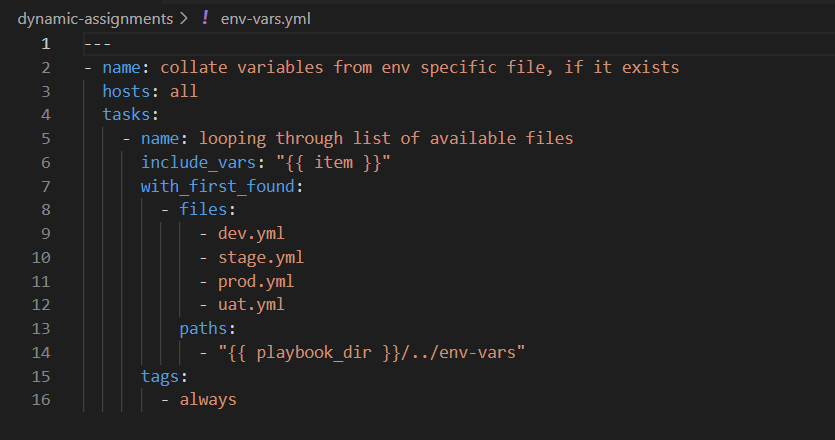

## ansible galaxy and installing specific ansible roles

preserving github repo in its actual state and pushing codes directly to master branch from jenkins-ansible server without needing webhook.

`$ git init`

`$ git pull https://github.com/demiladee/ansible-config-mgt.git`

`$ git remote add origin https://github.com/demiladee/ansible-config-mgt.git`

`$ git branch roles-feature`

`$ git switch roles-feature`

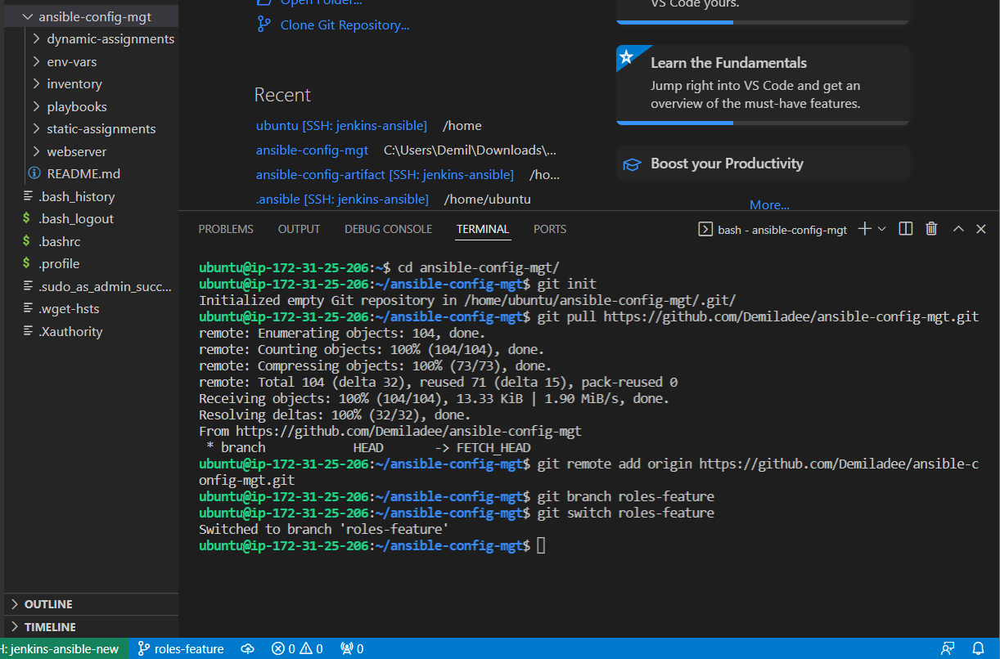

installed geerlingguy's mysql role inside the roles directory

`$ cd roles`

`$ ansible-galaxy install geerlingguy.mysql`

changed geerlingguy.mysql to mysql

`$ mv geerlingguy.mysql/ mysql`

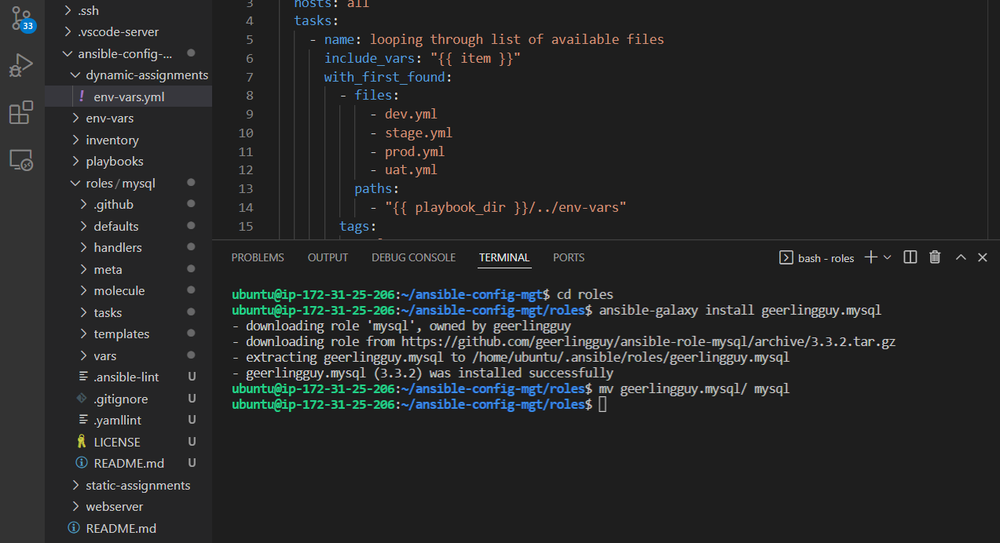

edited the roles configuration files to use correct credentials for mysql required for the tooling website and pushed to github

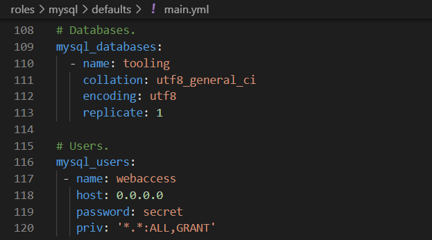

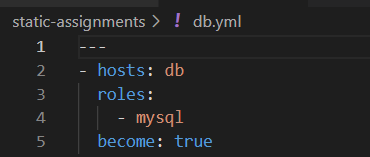

`$ git add .`

`$ git commit -m 'commit messaage'`

`$ git push --set-upstream origin roles-feature`

checked out into the folder that has the main branch and merged them

` $ cd ..`

`$ git checkout main`

` git merge dynamic assignment`

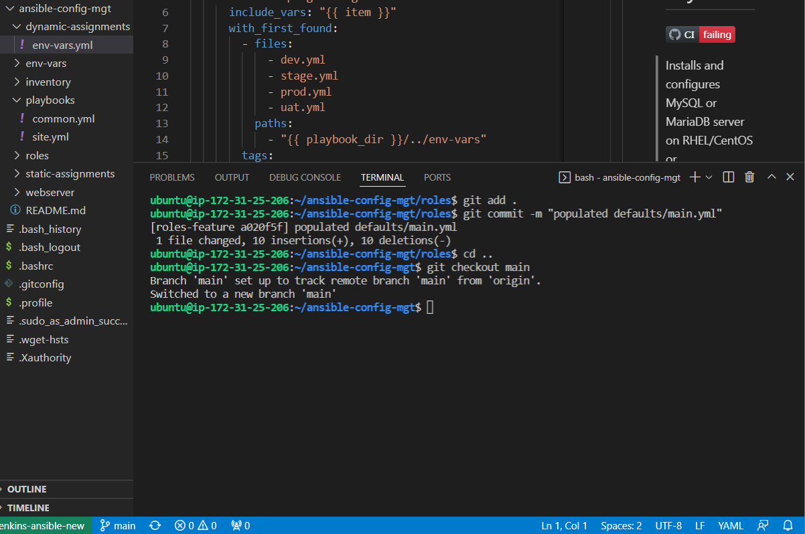

## load balancer roles

creating two load balancers, apache x nginx, to use interchangeably.

`$ ansible-galaxy install geerlingguy.nginx`

`$ mv geerlingguy.nginx/ nginx`

`$ ansible-galaxy install geerlingguy.apache`

`$mv geerlingguy.apache/ apache`

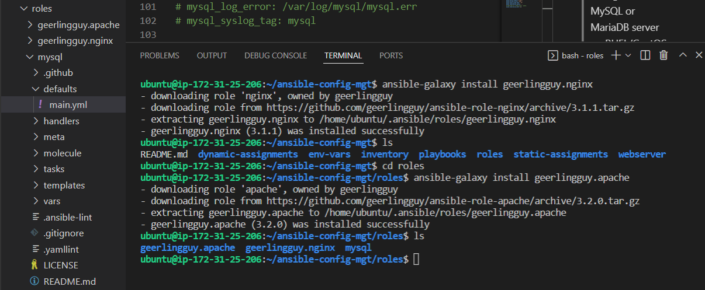

editing apache and nginx's role configuration file to serve the purpose needed.

declared variables in defaults/main.yml file of nginx and apache roles.

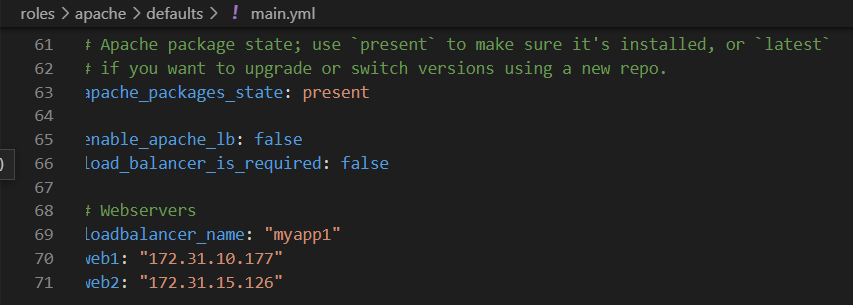

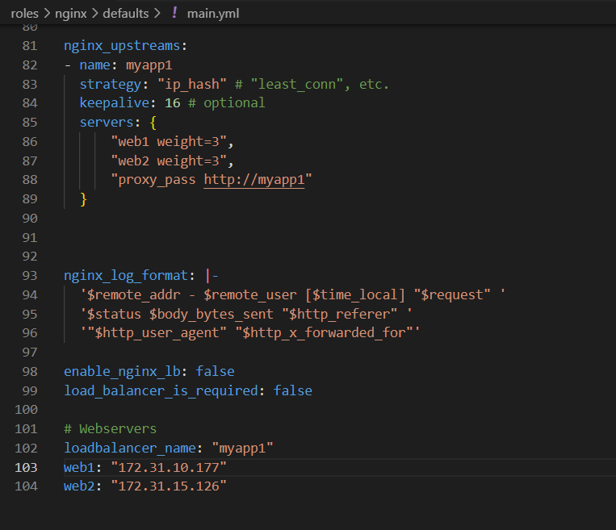

updating lb.yml and site.yml with the loadbalancer information

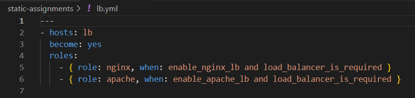

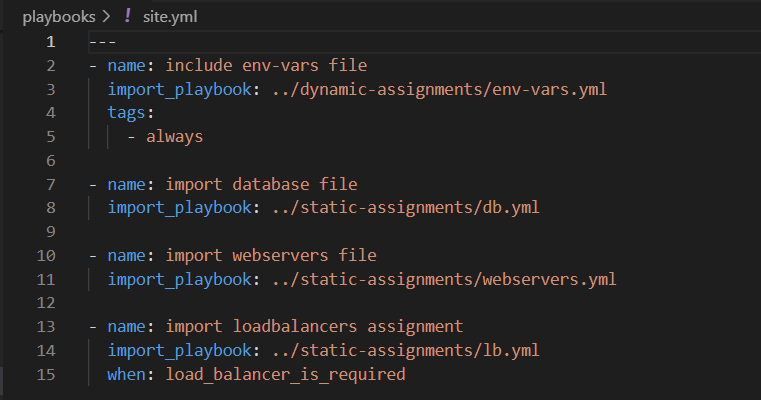

updating inventory/uat.yml with the lb ip addresses

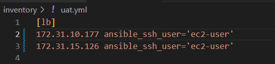

updating env-vars/uat.yml to enable apache loadbalancer

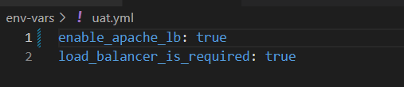

running apache play

`$ ansible-playbook -i inventory/uat.yml playbooks/site.yml`

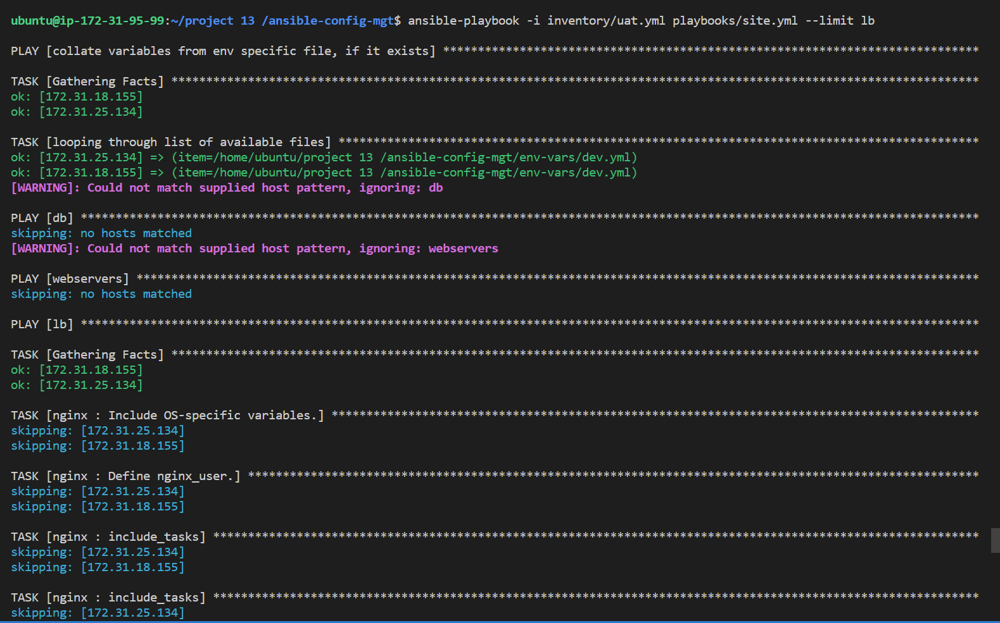

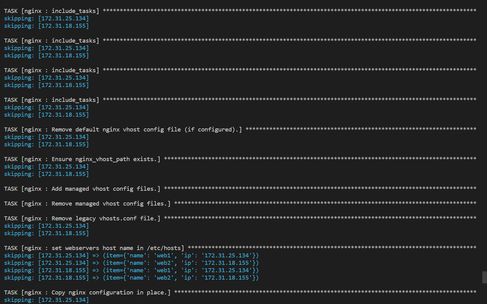

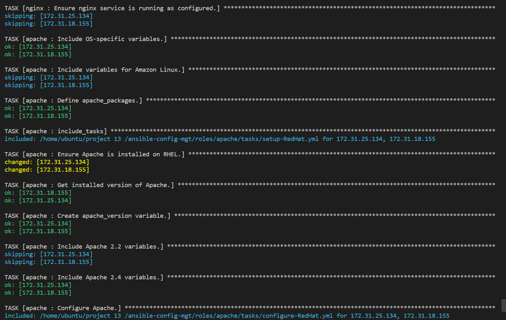

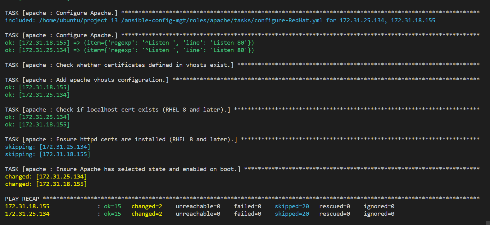

additional nginx configuration before running play

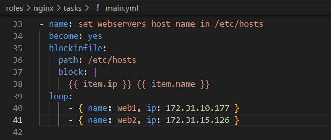

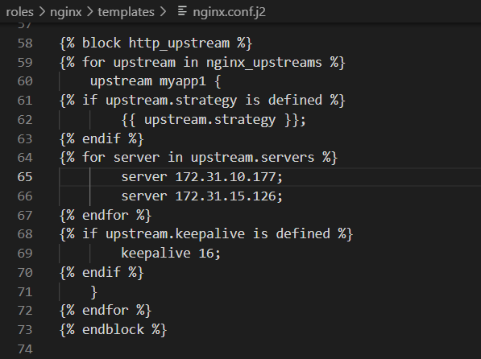

running nginx play

`$ ansible-playbook -i inventory/uat.yml playbooks/site.yml`

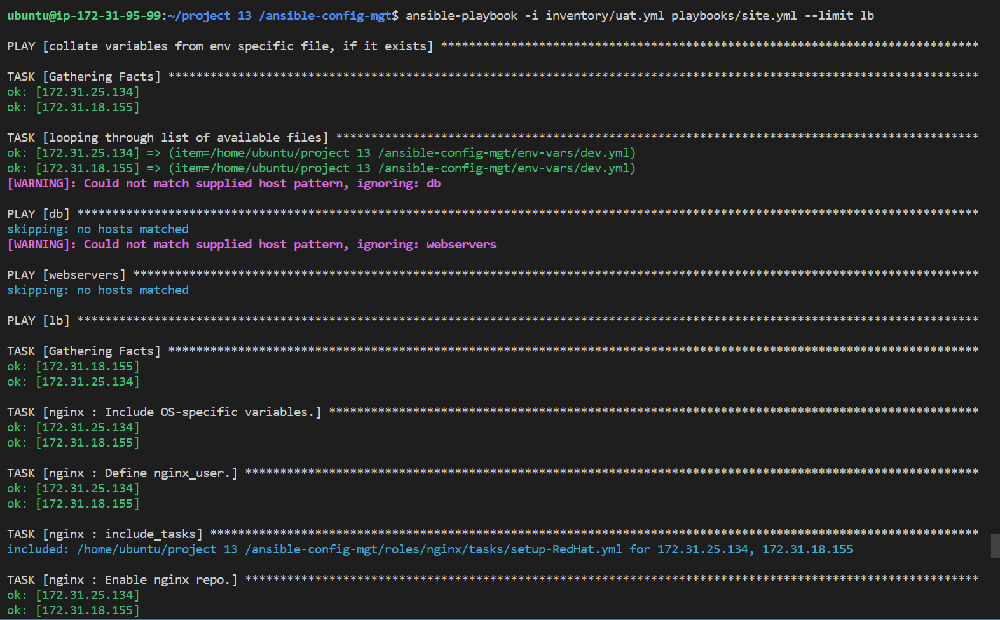

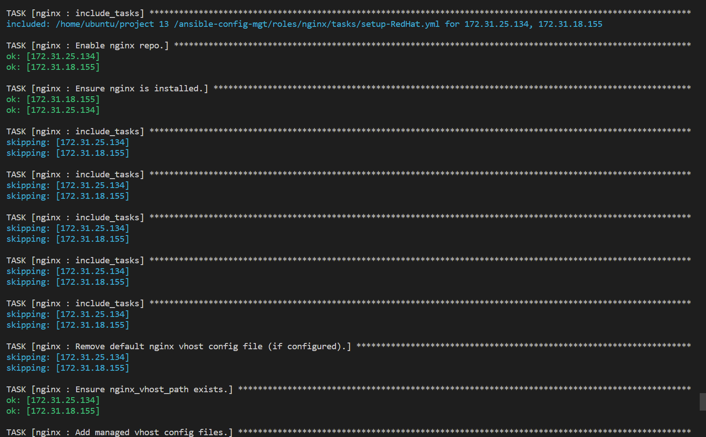

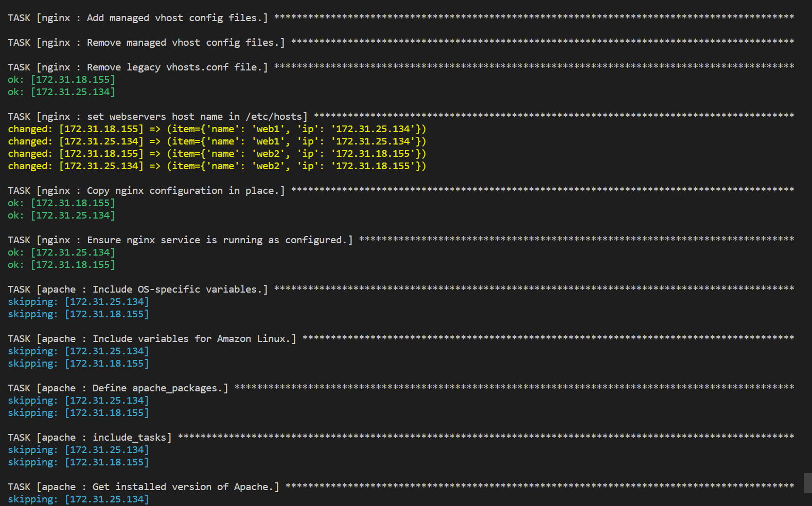

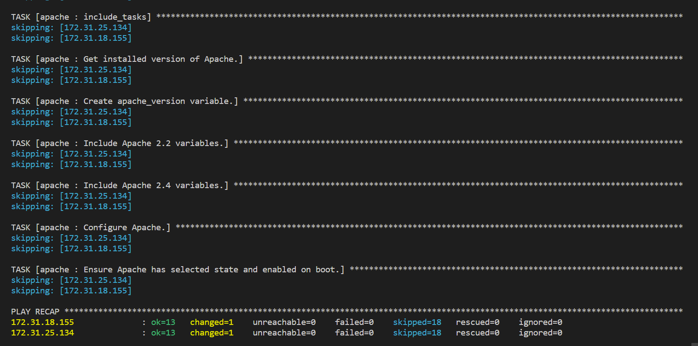